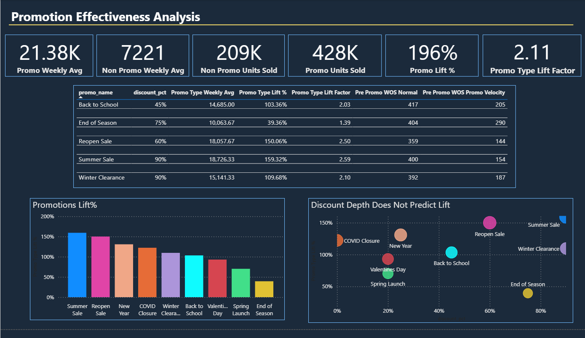
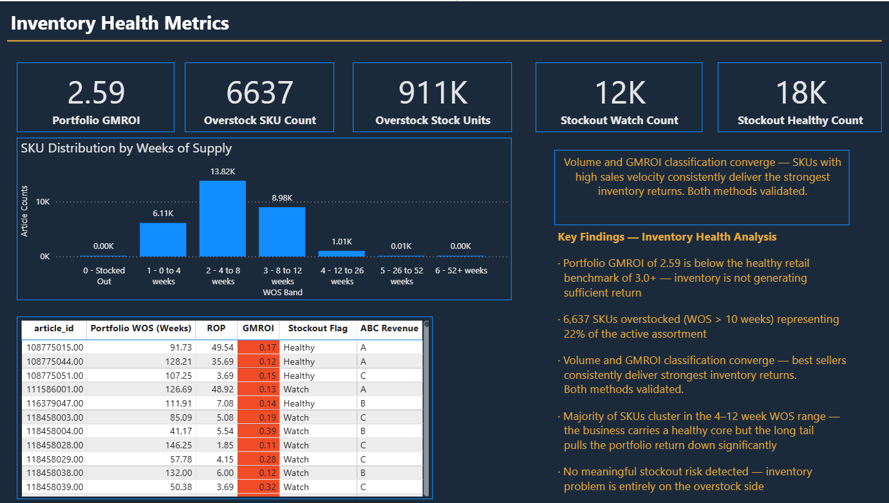
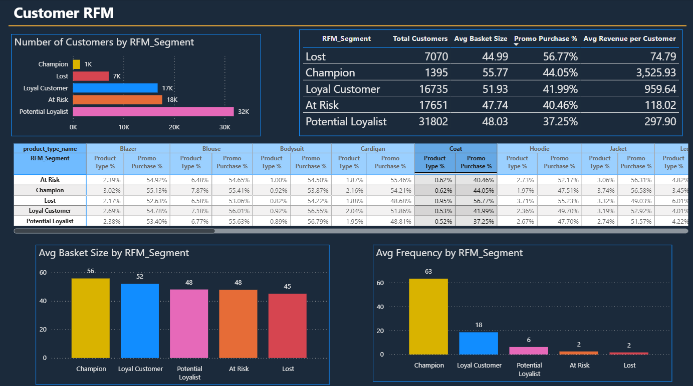
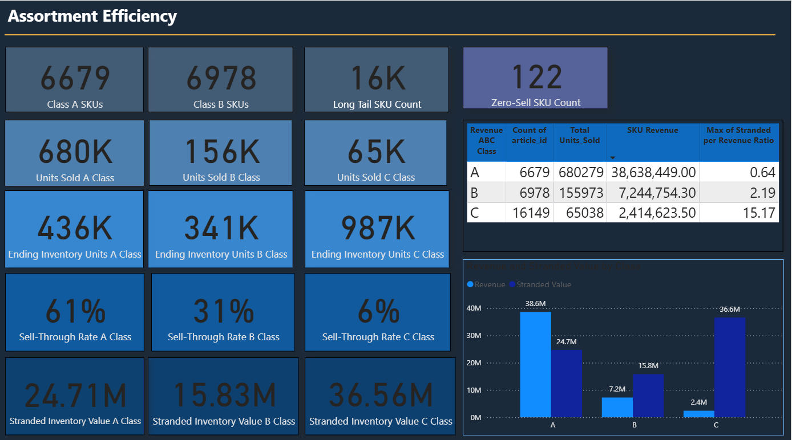
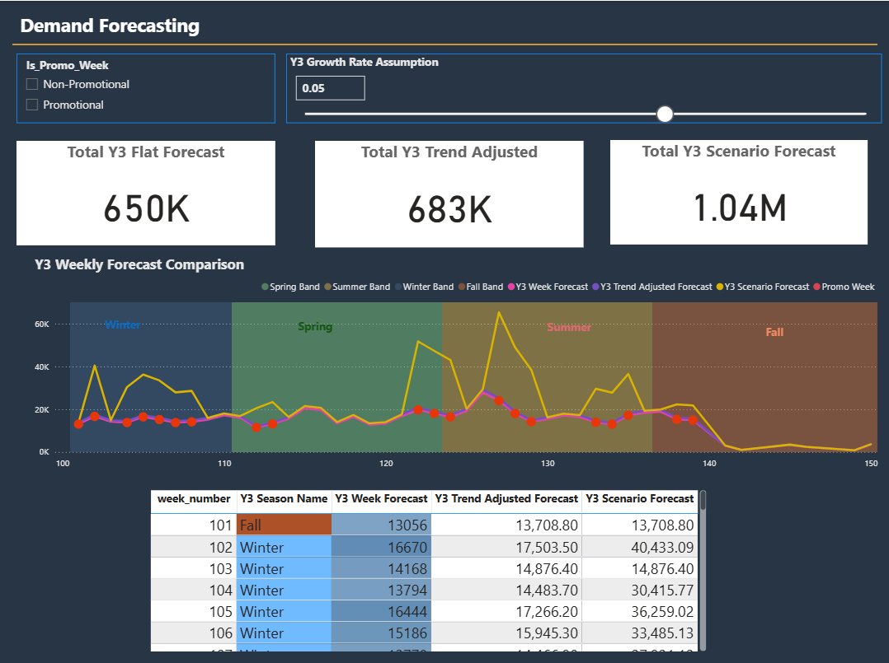
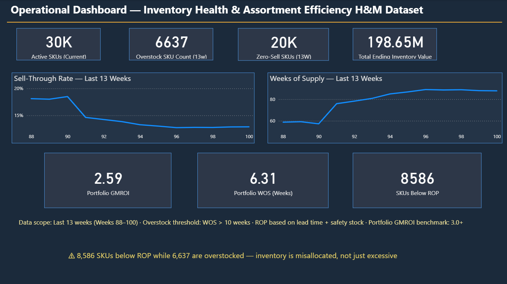
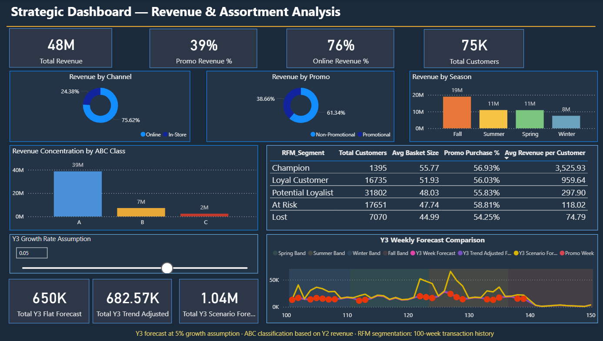

# H&M Retail Analytics — Project 2
### Power BI Portfolio | Retail Planning & Inventory Analytics
**Analyst:** Hamed Tamjidyamchelo | **Dataset:** H&M Synthetic | **Tool:** Power BI | **Date:** May 2026

---

## Project Overview

A 10-chapter end-to-end retail analytics portfolio built on a synthetic H&M dataset containing **1.37 million transaction rows across 100 weeks**. The project simulates the analytical work of a corporate retail planning analyst — from raw inventory data to executive-level dashboards — covering inventory health, promotion effectiveness, customer behaviour, demand forecasting, and assortment efficiency.

> *"A $48M digital-first business where 39% of revenue depends on promotions, 81% of revenue comes from 22% of SKUs, 17,651 customers are at risk, and inventory is misallocated — not just excessive."*

---

## Dataset

| Attribute | Detail |
|---|---|
| Source | Synthetic H&M retail dataset |
| Transactions | ~1.37M rows |
| Time Horizon | 100 weeks (Year 1 + Year 2) |
| SKUs | ~30,000 active articles |
| Customers | 75,000 |
| Channels | Online (76%) + In-Store (24%) |

---

## Portfolio Structure

| Chapter | Topic | Business Question |
|---|---|---|
| Ch 1 | Inventory Visibility | What does our stock position look like? |
| Ch 2 | Promotion Effectiveness | What actually drives promotional lift? |
| Ch 3 | Markdown Management | When and how should we mark down? |
| Ch 4 | Seasonality Analysis | Does the business follow seasonal patterns? |
| Ch 5 | Seasonal Index | How do we quantify seasonal demand? |
| Ch 6 | Inventory Health Metrics | Is our inventory generating sufficient return? |
| Ch 7 | Customer Behaviour / RFM | Who are our customers and what are they worth? |
| Ch 8 | Channel Performance | How does online compare to in-store? |
| Ch 9 | Assortment Efficiency | Which SKUs earn their shelf space? |
| Ch 10 | Executive Dashboards | Operational + Strategic views for leadership |

---

## Chapter Highlights

### Chapter 2 — Promotion Effectiveness Analysis

**Key Finding:** Discount depth does not predict promotional lift. The Summer Sale (90% discount) delivered 159% lift — but the Reopen Sale achieved 150% lift at only 60% discount. Higher discounts erode margin without guaranteeing stronger demand response.

| Metric | Value |
|---|---|
| Promo Weekly Avg | 21,380 units |
| Non-Promo Weekly Avg | 7,221 units |
| Overall Promo Lift % | 196% |
| Avg Promo Type Lift Factor | 2.11x |

---

### Chapter 6 — Inventory Health Metrics

**Key Finding:** Portfolio GMROI of 2.59 is below the healthy retail benchmark of 3.0+. The long tail of slow-moving SKUs is dragging portfolio returns down despite a healthy core assortment.

| Metric | Value |
|---|---|
| Portfolio GMROI | 2.59 (benchmark: 3.0+) |
| Overstock SKU Count | 6,637 (22% of assortment) |
| Overstock Stock Units | 911K units |
| SKUs in 4–12 Week WOS Band | ~22,800 (majority of assortment) |

---

### Chapter 7 — Customer Behaviour / RFM Analysis

**Key Finding:** Champions visit 63 times on average vs Lost customers at 2. Despite this engagement gap, promo purchase rates are consistent across all segments (~55–57%), confirming that promotional dependency is a business model issue — not a low-value customer problem.

| RFM Segment | Customers | Avg Frequency | Avg Revenue/Customer |
|---|---|---|---|
| Champion | 1,395 | 63 | $3,525.93 |
| Loyal Customer | 16,735 | 18 | $959.64 |
| Potential Loyalist | 31,802 | 6 | $297.90 |
| At Risk | 17,651 | 2 | $118.02 |
| Lost | 7,070 | 2 | $74.79 |

---

### Chapter 9 — Assortment Efficiency

**Key Finding:** Class C SKUs (54% of the assortment) generate only 5% of revenue while accumulating $36.6M in stranded inventory — $15 tied up for every $1 earned. The assortment is carrying significant dead weight.

| Class | SKUs | Revenue | Sell-Through | Stranded Value | Stranded per $1 |
|---|---|---|---|---|---|
| A | 6,679 | $38.6M | 61% | $24.7M | $0.64 |
| B | 6,978 | $7.2M | 31% | $15.8M | $2.19 |
| C | 16,149 | $2.4M | 6% | $36.6M | $15.17 |
| Zero-Sell | 122 | $0 | 0% | — | — |

---

### Chapter 10 — Demand Forecasting

Three-scenario Y3 forecast model with interactive growth rate assumption slicer. Fall consistently drives peak demand across both historical and forecast periods.

| Forecast Model | Y3 Total Units |
|---|---|
| Flat (Moving Average) | 650K |
| Trend Adjusted (+5%) | 683K |
| Scenario (Promo-Adjusted) | 1.04M |

---

## Executive Dashboards — Chapter 10

### Operational Dashboard
*For allocation analysts and replenishment planners — weekly decision support*

| KPI | Value | Signal |
|---|---|---|
| Active SKUs | 30K | Scale of assortment |
| Overstock SKU Count (13W) | 6,637 | 22% of assortment too heavy |
| Zero-Sell SKUs (13W) | 20K | 67% had no sales last quarter |
| Total Ending Inventory Value | $198.65M | Capital tied up |
| Sell-Through Rate (Week 88→100) | 19% → 13% | Worsening sell velocity |
| WOS Trend (Week 88→100) | 59 → 87 weeks | Stock accumulating |
| Portfolio GMROI | 2.59 | Below 3.0+ benchmark |
| SKUs Below ROP | 8,586 | Reorder signal |

> ⚠ *8,586 SKUs below ROP while 6,637 are overstocked — inventory is misallocated, not just excessive*

---

### Strategic Dashboard
*For merchandise directors and senior buyers — quarterly business review*

| KPI | Value | Signal |
|---|---|---|
| Total Revenue (Y2) | $48M | Business scale |
| Promo Revenue % | 39% | Heavy promo dependency |
| Online Revenue % | 76% | Digital-first business |
| Total Customers | 75K | Customer base |
| Fall Revenue | $19M | Dominant season |
| Class A Revenue Share | 81% | Extreme concentration |
| At Risk Customers | 17,651 | Largest segment — retention priority |

---

## Key Business Insights

1. **Promo dependency is structural, not segmental** — 39% of revenue depends on promotional weeks and ~56% promo purchase rate is consistent across all customer segments including Champions

2. **Inventory is misallocated, not just excessive** — 8,586 SKUs need replenishment while 6,637 are overstocked simultaneously

3. **Long tail is destroying portfolio returns** — C-class SKUs generate $15 of stranded inventory per $1 of revenue earned

4. **Discount depth does not predict lift** — higher discounts erode margin without guaranteeing stronger demand

5. **Sell-through declining while WOS rising** — a compounding inventory crisis in the last 13 weeks

6. **Customer retention is the highest-ROI strategic priority** — 17,651 At Risk customers each worth $118 vs Champion's $3,526

---

## Technical Skills Demonstrated

### DAX
- Context transition and filter propagation
- `CALCULATETABLE`, `TREATAS`, `FILTER`, `SUMX`, `DISTINCTCOUNT`
- `VAR` pattern for complex multi-step calculations
- `LOOKUPVALUE` bridge for relationship workarounds
- `SWITCH(TRUE())` for dynamic classification
- Cumulative sell-through vs weekly sell-through measures
- Cross-table filtering with `TREATAS` where physical relationships are absent

### Power Query
- `List.Generate` for O(n) running total (replacing O(n²) `List.Sum(List.FirstN())`)
- Reference query architecture (`inventory_13w` from `inventory_new`)
- Threshold-based ABC classification
- Custom column logic for week mapping and promo flags

### Data Modelling
- Star schema design across 8+ tables
- Calculated column bridges for relationship chain extension
- Enter Data tables for chart workarounds
- Inactive relationship management

### Retail Analytics Concepts
- Weeks of Supply (WOS), Reorder Point (ROP), Safety Stock
- GMROI, ABC Classification (Revenue and Volume)
- Sell-Through Rate, Stranded Inventory Value
- Promotional Lift Factor, Pre-Promo Stock Coverage
- RFM Segmentation (Recency, Frequency, Monetary)
- Seasonal Index calculation
- Three-scenario demand forecasting (Flat / Trend-Adjusted / Scenario)

---

## Tools & Technologies

| Tool | Usage |
|---|---|
| Power BI Desktop | All dashboards and chapter pages |
| DAX | All measures and calculated columns |
| Power Query (M) | Data transformation and ABC classification |
| GitHub | Portfolio hosting |

---

## Related Project

**Project 1 — Tankhoone Fashion Retail Analytics (Excel)**
Excel-based retail analytics portfolio covering 40 SKUs across demand analysis, inventory health, financial metrics, and executive dashboards.
→ [View Project 1](https://github.com/hamed-tamjidi/retail-analytics-portfolio)

---

*Analyst: Hamed Tamjidyamchelo | North York, ON | May 2026*
*Target roles: Allocation Analyst · Replenishment Analyst · Planning Analyst · Junior Buyer*
